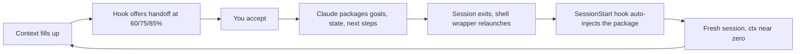
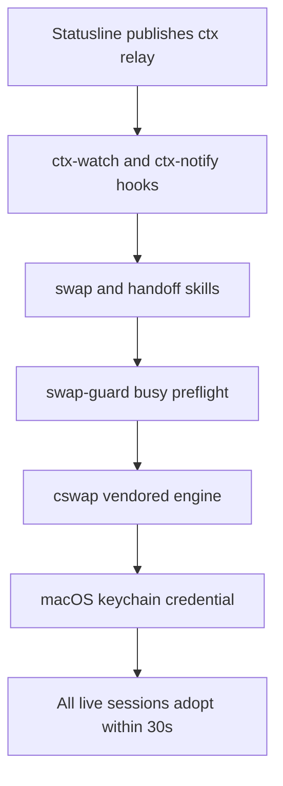

# overclaude

[](https://pypi.org/project/overclaude/)
[](LICENSE)


**Claude Code, overclocked.** Hot-swap between Claude accounts without leaving your session, hand off to a fresh session before context fills up, and watch every usage meter live:

```text
Fable 5 (high) | myproject (master*) | 3 sessions | 👤 work [1/2]
└ model+effort   └ folder+branch*      └ live count └ account [slot/total]

ctx [████░░░░░░] 42% | 5h [███████░░░] 71% | week [██░░░░░░░░] 18% | Fable [███████░░░] 73%
└ context window       └ 5-hour limit         └ weekly limit           └ model-scoped bucket
                       bars turn yellow at 50% · red at 80%
```

## Install

```bash
pipx install overclaude && overclaude install
```

Then register your accounts (once):

```bash
cswap add             # registers the account you're logged in as
cswap alias 1 work    # name your slots
cswap alias 2 personal
exec zsh              # reload shell
```

Start a **new** Claude Code session (hooks load at session start) and check the statusline shows `👤 work [1/2]`. Adding a second account is guided — run `/swap add` inside Claude Code.

<details>
<summary>Other install methods, requirements, upgrading</summary>

```bash
# uv
uv tool install overclaude && overclaude install

# from source
git clone https://github.com/arthur-bump-pm/overclaude && cd overclaude && ./install.sh

# track unreleased main
pipx install git+https://github.com/arthur-bump-pm/overclaude.git
```

Or paste this into any Claude Code session and let it install itself:

> Install overclaude (https://github.com/arthur-bump-pm/overclaude) on this machine, fix anything its preflight complains about, and tell me what post-install steps I need to do myself.

**Requirements:** macOS, zsh, `jq`, `pipx` or `uv`, Max-style Claude subscription accounts. The credential engine (cswap) ships inside the package and installs automatically.

**Upgrade:** `pipx upgrade overclaude && overclaude install`

**Uninstall:** `overclaude uninstall` — removes exactly what install added (backed up, settings merged out); account state in `~/.claude-swap-backup/` survives.

The installer is idempotent and conservative: timestamped backups of everything it touches, jq-merge into your existing `settings.json` (other hooks survive), never overwrites an existing statusLine, re-running is a no-op.

</details>

## What you get

### `/swap` — hot account switching
Every live Claude Code session on the machine adopts the new account's credential within ~30 s — mid-conversation, no restart, context preserved. Hit a rate limit? `/swap work` and keep typing. A preflight blocks the swap while another session is mid-task (`force` overrides).

### `/handoff` — escape context bloat, keep the thread



You lose the token bloat, not the thread. Works same-account (`/handoff`) or combined with a switch (`/swap work handoff`).

### Statusline
The two-line display above — and the kit's data spine: it publishes each session's context % to a relay the threshold hooks read. **Skip the kit's statusline and handoff offers never fire.**

### `ULTRACODE.md` — model routing for multi-agent workflows
A policy loaded into every session: bulk work rides cheap models, verification rides opus, only final judgment spends the top tier. Routing table, hard floors, escalation rules included.

## Cheat sheet

| Command | Effect |
|---|---|
| `/swap` | Dashboard: accounts, usage, token health, live sessions |
| `/swap <target>` | Hot-swap all sessions to `<target>` (alias, slot, or email) |
| `/swap <target> force` | Same, bypassing the busy-session guard |
| `/swap <target> handoff` | Switch account + package this session + resume fresh |
| `/swap <target> restart` | Switch + restart this session in place (auth edge cases) |
| `/swap add` | Guided registration of a new account |
| `/handoff` | Package this session and continue fresh, same account |
| `/handoff status` | Context %, thresholds fired, pending package state |
| `/handoff cancel` | Cancel a pending handoff |
| `swap <alias>` *(shell)* | Panic-switch from any terminal, even with sessions hung |

Or skip memorizing and **paste a prompt**:

| Paste into Claude Code | Runs |
|---|---|
| "Swap me to my work account" | `/swap work` |
| "Context is getting full — hand off to a fresh session" | `/handoff` |
| "Swap to personal and hand off in one shot" | `/swap personal handoff` |
| "What's my context and account usage right now?" | `/handoff status` + `/swap` dashboard |
| "Install overclaude on this machine" | the whole install flow (works before the kit exists) |
| "Upgrade overclaude and refresh the hooks" | `pipx upgrade overclaude && overclaude install` |

## How it fits together



The heavy lifting — credential storage, keychain switching, OAuth refresh, usage polling — is **[claude-swap](https://github.com/realiti4/claude-swap)** by [Onur Cetinkol](https://github.com/realiti4) (MIT), vendored unmodified in `vendor/claude-swap/` and installed automatically. Go star it.

<details>
<summary>Caveats worth knowing</summary>

- A swap flips **all** live Claude Code sessions on the machine — it's the shared keychain credential, not per-terminal.
- Hooks load at session start; sessions already open at install time won't offer handoffs until restarted (hot-swap works everywhere immediately).
- The Fable/scoped meter reads cswap's cache — it refreshes whenever cswap runs and can lag between invocations. The 5h/week meters describe whichever account served the last response, so they lag ~1 turn after a swap; the 👤 segment is always current.
- Legacy clients that don't report status (older VS Code extension builds) are judged busy/idle by transcript mtime during swap preflight.
- claude.ai connectors (Gmail/Drive/…) are per-account server-side and don't follow a swap.
- Context thresholds re-arm 10 points below a fired threshold; Claude Code's auto-compact stays as the backstop.

</details>

<details>
<summary>Components (file → destination)</summary>

| File | Installs to | Role |
|---|---|---|
| `bin/swap-guard` | `~/.local/bin/` | State/guard engine: whoami, live-session table, busy preflight, per-directory handoff state |
| `skills/swap/SKILL.md` | `~/.claude/skills/swap/` | The `/swap` skill |
| `skills/handoff/SKILL.md` | `~/.claude/skills/handoff/` | The `/handoff` skill |
| `hooks/handoff-inject.sh` | `~/.claude/hooks/` | SessionStart: auto-loads a pending handoff package (10-min TTL, per-directory) |
| `hooks/ctx-watch.sh` | `~/.claude/hooks/` | UserPromptSubmit: fires the 60/75/85% offers with re-arm hysteresis |
| `hooks/ctx-notify.sh` | `~/.claude/hooks/` | Stop: threshold banners |
| `statusline/statusline-command.sh` | `~/.claude/statusline-command.sh` | Renders the statusline; publishes the ctx relay |
| `claude/ULTRACODE.md` | `~/.claude/` + `CLAUDE.md` import | Model/effort routing policy |
| `settings/settings-fragment.json` | merged into `~/.claude/settings.json` | 3 hook groups, statusLine, 2 permission allows |
| `shell/zshrc-snippet.sh` | `~/.zshrc` (markers) | `claude()` relaunch wrapper, `swap` alias, PATH guard |
| `vendor/claude-swap/` | pipx/uv-installed if absent | The bundled credential engine |

</details>

<details>
<summary>Maintainer workflow</summary>

```bash
./sync.sh            # live setup -> repo: scrub-gated diff, commit, push
./sync.sh --release  # + version bump + GitHub release -> PyPI (trusted publishing)
./sync.sh --dry-run  # preview either
```

A plain `git push` updates git installs only — **PyPI users get changes only via releases**. The scrub gate aborts any commit whose diff contains usernames, emails, or `/Users/…` paths. See `CLAUDE.md` for the full protocol.

</details>

## License

MIT — see [LICENSE](LICENSE). Vendored claude-swap retains its own MIT license and copyright (Onur Cetinkol).
