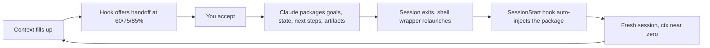
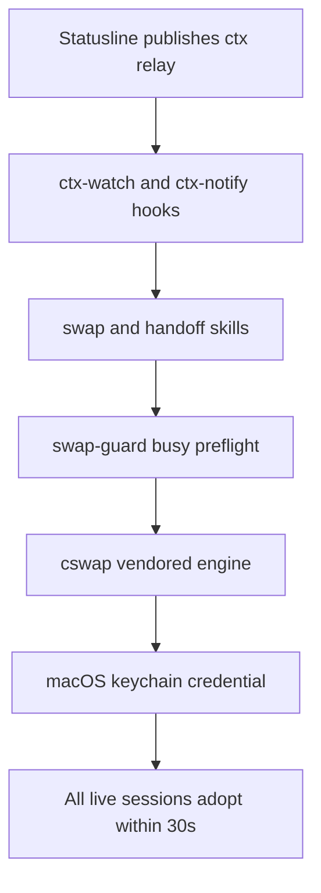

# overclaude

[](https://pypi.org/project/overclaude/)
[](LICENSE)


**Claude Code, overclocked.** Hot-swap between Claude accounts without leaving your session, hand off to a fresh session before context fills up, and watch every usage meter live:

```text
Fable 5 (high) | myproject (master*) | 3 sessions | 👤 work [1/2] ↻ Thu Oct 9 23:59 (1d 6h)
└ model+effort   └ folder+branch*      └ live count └ account     └ when its weekly limit resets

ctx [████░░░░░░] 42% | 5h [███████░░░] 71% | week [██░░░░░░░░] 18% | Fable [███████░░░] 73%
└ context window       └ 5-hour limit         └ weekly limit           └ model-scoped bucket

↳ personal [2] 5h 10% · week 85% · Fable 100% ↻ Thu Oct 9 17:59 (1d 1h)
└ every OTHER account: its limits + weekly reset, so you know where to swap next

bars and percentages turn yellow at 50% · red at 80%
```

## What's new in 1.3

- **Instant swap on a usage cap** — the moment "You've reached your Fable limit" stops a session, a hook switches to the account with the most room on that limit and wakes the session to carry on. Sessions that hit the cap together share one swap; a short-lived 429 slowdown never swaps; dead, disabled and API-key accounts are never targets. On by default (`/swap auto instant off` to disable), independent of the opt-in background auto-swap.
- **Re-login that doesn't kill your other account** — refresh tokens are single-use, so a plain `/login` over the live account overwrote its newest token and that account died next: re-logging one account killed the other, in turn. `/swap relogin <account>` (or `swap-guard login <account>` in a terminal) saves the live account's token first and signs in inside a throwaway profile, so the live login is never touched. `/swap add` uses the same flow and no longer needs `/logout`.
- **The model sees your usage** — when the active account crosses 75/90/100% of a model limit (or 85/95/100% weekly, 90/100% 5-hour), one line tells Claude, so ULTRACODE's budget rules (cut fan-out, keep the top tier for the final synthesis) actually kick in — with a pointer to an account that has room. One more line when the pressure clears; silent otherwise.
- **One list of every artifact** — every publish is recorded with the account that owns it and a durable copy of its source. `/swap artifacts villa` finds it from any account; `swap-guard artifacts index` backfills artifacts published before 1.3 (owner inferred from cswap's switch history).
- **Same link across accounts** — handoffs now say which account owns each artifact and suggest sharing it to the next account with edit access, so the new session updates it in place instead of republishing a copy at a new URL.
- **`overclaude update`** — upgrades however you installed it (pipx, uv or pip) and reinstalls the kit. The statusline shows `⬆ overclaude X available` when a release is out (checked in the background once a day; `OVERCLAUDE_NO_UPDATE_CHECK=1` hides it).
- **`overclaude doctor --fix`** (or `/swap doctor fix`) — reinstalls drifted or missing files and hooks, reloads a stopped auto-swap agent, offers the safe re-login for dead tokens, then checks again.
- **Safer releases** — the release script runs shellcheck and the full test suite before anything is committed or tagged, and the publish job reuses the push's test run instead of queueing a second macOS job.

## What's new in 1.2

- **Busy-aware auto-swap (opt-in)** — `/swap auto on` installs a background agent that switches accounts *before* you hit a wall. It never flips credentials while a session is mid-task (proactive switches wait); at-limit switches go through, dead tokens are skipped, bad settings are refused at install, and a macOS notification tells you what happened.
- **`overclaude doctor`** — one read-only command that checks dependencies, installed files, hooks, statusline, account tokens, sessions running stale hooks, and the auto-swap agent, with the exact fix for each problem. Also `/swap doctor`.
- **Recover expired handoffs** — `/handoff history` lists past packages; `/handoff restore [n]` re-arms one (packages expire 10 minutes after you leave a session). A package it replaces is archived, never discarded.
- **Handoffs never get truncated** — Claude Code caps hook output at 10,000 characters; oversized packages now inject section by section with a pointer to the full file, and the skill writes to a size budget.
- **cswap 0.26** bundled (was 0.21), and `overclaude install` upgrades an older copy.
- **Tests + CI** — a plain-bash suite (statusline, handoff budget, history/restore, auto-swap decisions, artifact snapshots) runs on macOS for every push, and releases only publish when it passes.

## What's new in 1.1

- **Weekly reset on the statusline** — `↻ Thu Oct 9 23:59 (1d 6h)` next to the account, in local time.
- **See every account's limits** — one compact line per other account (5h / week / Fable + reset), with `⚠ relogin` when a token has died.
- **Artifacts survive a handoff** — claude.ai artifacts the session made are snapshotted (sources + URLs + owner) before an account switch and handed to the next session, which keeps editing them or re-homes them on the new account.
- **Handoff packages before it switches** — so nothing that needs the old account (artifacts, artifact data) is lost to the credential flip.

## Install

```bash
pipx install overclaude && overclaude install
```

> **Fresh machine?** If you get `command not found: overclaude`, pipx's bin folder isn't on your PATH yet — run `pipx ensurepath && source ~/.zshrc`, then `overclaude install`. (Use `source`, not `exec zsh`: replacing the shell swallows any commands you pasted after it.)

Then register your accounts (once):

```bash
cswap add             # registers the account you're logged in as
cswap alias 1 work    # name your slots
cswap alias 2 personal
exec zsh              # reload shell
```

Start a **new** Claude Code session (hooks load at session start) and check the statusline shows `👤 work [1/2]`. Adding a second account is guided — run `/swap add` inside Claude Code. Anything look wrong? `overclaude doctor` checks the whole setup and prints the fix for each problem.

<details>
<summary>Other install methods, requirements, upgrading</summary>

```bash
# uv
uv tool install overclaude && overclaude install

# from source
git clone https://github.com/arthur-bump-pm/overclaude && cd overclaude && ./install.sh

# track unreleased main
pipx install git+https://github.com/arthur-bump-pm/overclaude.git
```

Or paste this into any Claude Code session and let it install itself:

> Install overclaude (https://github.com/arthur-bump-pm/overclaude) on this machine, fix anything its preflight complains about, and tell me what post-install steps I need to do myself.

**Requirements:** macOS, zsh, `jq`, `pipx` or `uv`, Max-style Claude subscription accounts. The credential engine (cswap) ships inside the package and installs automatically.

**Upgrade:** `pipx upgrade overclaude && overclaude install`

**Uninstall:** `overclaude uninstall` — removes exactly what install added (backed up, settings merged out); account state in `~/.claude-swap-backup/` survives.

The installer is idempotent and conservative: timestamped backups of everything it touches, jq-merge into your existing `settings.json` (other hooks survive), never overwrites an existing statusLine, re-running is a no-op.

</details>

## What you get

### `/swap` — hot account switching
Every live Claude Code session on the machine adopts the new account's credential within ~30 s — mid-conversation, no restart, context preserved. Hit a rate limit? `/swap work` and keep typing. A preflight blocks the swap while another session is mid-task (`force` overrides).

### `/handoff` — escape context bloat, keep the thread


```mermaid
flowchart LR
    A[Context fills up] --> B[Hook offers handoff at 60/75/85%]
    B --> C[You accept]
    C --> D[Claude packages goals, state, next steps, artifacts]
    D --> E[Session exits, shell wrapper relaunches]
    E --> F[SessionStart hook auto-injects the package]
    F --> G[Fresh session, ctx near zero]
    G --> A
```

You lose the token bloat, not the thread. Works same-account (`/handoff`) or combined with a switch (`/swap work handoff`).

**Artifacts travel too.** Before switching accounts, handoff runs `swap-guard artifacts`: it reads the session transcript (subagents and workflows included), finds every claude.ai artifact the session published or touched, copies each source out of the session's temporary scratchpad into `~/.claude-swap-backup/handoff-artifacts/<session>/`, and lists them in the package with their URLs and owner account. Artifacts belong server-side to the account that published them, so the next session updates them in place on the same account, and on a different account republishes from the saved source as a new artifact (or updates in place if you shared the original with edit access). Artifact database rows can be exported before the switch on request.

### Statusline
The display at the top. Line 1 ends with the active account and when its **weekly limit resets** (local time + countdown). Line 2 is the live meters. Below that, each **other account** gets a compact line with its 5h / week / Fable usage and weekly reset, so you can see where to swap before you hit a wall — `⚠ relogin` flags a dead token, a dim `(2h old)` flags stale numbers, and `SWAP_HIDE_OTHERS=1` hides these lines.

Usage numbers come from cswap's per-account cache, kept ≤ ~5 min fresh by a debounced background refresh (the render itself never waits on the network). It is also the kit's data spine: it publishes each session's context % to a relay the threshold hooks read. **Skip the kit's statusline and handoff offers never fire.**

### `ULTRACODE.md` — model routing for multi-agent workflows
A policy loaded into every session: bulk work rides cheap models, verification rides opus, only final judgment spends the top tier. Routing table, hard floors, escalation rules included.

## Cheat sheet

| Command | Effect |
|---|---|
| `/swap` | Dashboard: accounts, usage, token health, live sessions |
| `/swap <target>` | Hot-swap all sessions to `<target>` (alias, slot, or email) |
| `/swap <target> force` | Same, bypassing the busy-session guard |
| `/swap <target> handoff` | Package this session (+ its artifacts), switch account, resume fresh |
| `/swap <target> restart` | Switch + restart this session in place (auth edge cases) |
| `/swap add` | Register a new account (browser sign-in; live sessions untouched) |
| `/swap relogin <account>` | Revive a dead token without killing the live account's |
| `/handoff` | Package this session and continue fresh, same account |
| `/handoff status` | Context %, thresholds fired, pending package state |
| `/handoff cancel` | Cancel a pending handoff |
| `/handoff history` | List archived handoff packages for this folder |
| `/handoff restore [n]` | Re-arm an archived package (default: newest), then Ctrl+D |
| `/swap auto on\|off\|status` | Busy-aware background auto-swap (`threshold N`, `model Fable`) |
| `/swap auto instant on\|off` | Instant swap the moment a usage cap stops a session (default on) |
| `/swap artifacts [words]` | Search every artifact you published, with its owning account |
| `/swap doctor [fix]` *(or `overclaude doctor [--fix]`)* | Health check with fixes; `fix` applies the safe ones |
| `overclaude update` *(shell)* | Upgrade from PyPI and reinstall the kit |
| `swap-guard artifacts` *(shell)* | Snapshot this session's claude.ai artifacts (sources + manifest) |
| `swap <alias>` *(shell)* | Panic-switch from any terminal, even with sessions hung |

Or skip memorizing and **paste a prompt**:

| Paste into Claude Code | Runs |
|---|---|
| "Swap me to my work account" | `/swap work` |
| "Context is getting full — hand off to a fresh session" | `/handoff` |
| "Swap to personal and hand off in one shot" | `/swap personal handoff` |
| "What's my context and account usage right now?" | `/handoff status` + `/swap` dashboard |
| "Switch accounts automatically before I hit my Fable limit" | `/swap auto on model Fable` |
| "Something's off with my setup — check it" | `/swap doctor` |
| "My work account says relogin — fix it" | `/swap relogin work` |
| "Where's that villa comparison artifact?" | `/swap artifacts villa` |
| "My handoff expired — bring it back" | `/handoff restore` |
| "Install overclaude on this machine" | the whole install flow (works before the kit exists) |
| "Upgrade overclaude and refresh the hooks" | `overclaude update` |

## How it fits together


```mermaid
flowchart TD
    SL[Statusline publishes ctx relay] --> HK[ctx-watch and ctx-notify hooks]
    HK --> SK[swap and handoff skills]
    SK --> GD[swap-guard busy preflight]
    GD --> CS[cswap vendored engine]
    CS --> KC[macOS keychain credential]
    KC --> AS[All live sessions adopt within 30s]
```

The heavy lifting — credential storage, keychain switching, OAuth refresh, usage polling — is **[claude-swap](https://github.com/realiti4/claude-swap)** by [Onur Cetinkol](https://github.com/realiti4) (MIT), vendored unmodified in `vendor/claude-swap/` and installed automatically. Go star it.

<details>
<summary>Caveats worth knowing</summary>

- A swap flips **all** live Claude Code sessions on the machine — it's the shared keychain credential, not per-terminal.
- Hooks load at session start; sessions already open at install time won't offer handoffs until restarted (hot-swap works everywhere immediately).
- Usage meters read cswap's cache for the active account (correct the moment a swap lands) and are refreshed in the background every ~5 min while any statusline renders; past 10 min a dim `(usage Nm old)` marker appears. The ctx meter is real-time.
- An inactive account whose reset time has passed is shown at 0% — nothing on this machine has used it since. Usage from elsewhere (claude.ai web, another machine) appears on the next refresh.
- claude.ai artifacts are owned by the account that published them. After a cross-account handoff the old URLs stay viewable from the owner account but aren't editable from the new one — the next session re-homes them from the saved source (new URL), unless you share the original with edit access.
- Instant swap wakes the stopped session through Claude Code's `asyncRewake` hook mechanism; if your Claude Code version doesn't resume it, the notification tells you to send any message. Each session is woken at most once per 10 minutes, so an account that is still capped can't loop.
- Never re-login a dead account with a plain `/login` while another account is live — use `/swap relogin` (see 1.3 notes). `cswap run` profiles hold a second copy of an account's token chain and can fork it the same way.
- Legacy clients that don't report status (older VS Code extension builds) are judged busy/idle by transcript mtime during swap preflight.
- claude.ai connectors (Gmail/Drive/…) are per-account server-side and don't follow a swap.
- Context thresholds re-arm 10 points below a fired threshold; Claude Code's auto-compact stays as the backstop.
- Auto-swap: a session that Claude Code paused at a usage limit doesn't resume by itself after a background switch (Claude Code only re-checks after `/model`, `/usage-credits`, or `/upgrade`) — send any message and it continues on the new account. Proactive switches wait while any session is busy, so a machine that is never idle only switches at the limit. The agent doesn't do cswap's "failover" for an account whose usage can't be read — that needs a long-running `cswap auto` loop.

</details>

<details>
<summary>Components (file → destination)</summary>

| File | Installs to | Role |
|---|---|---|
| `bin/swap-guard` | `~/.local/bin/` | State/guard engine: whoami, live-session table, busy preflight, per-directory handoff state, handoff history/restore, artifact snapshots + registry, busy-aware auto-swap, instant swap on a usage cap, usage-band notes for the model, safe re-login |
| `skills/swap/SKILL.md` | `~/.claude/skills/swap/` | The `/swap` skill |
| `skills/handoff/SKILL.md` | `~/.claude/skills/handoff/` | The `/handoff` skill |
| `hooks/handoff-inject.sh` | `~/.claude/hooks/` | SessionStart: auto-loads a pending handoff package (10-min TTL, per-directory) |
| `hooks/ctx-watch.sh` | `~/.claude/hooks/` | UserPromptSubmit: fires the 60/75/85% offers with re-arm hysteresis |
| `hooks/ctx-notify.sh` | `~/.claude/hooks/` | Stop: threshold banners |
| `statusline/statusline-command.sh` | `~/.claude/statusline-command.sh` | Renders the statusline; publishes the ctx relay |
| `claude/ULTRACODE.md` | `~/.claude/` + `CLAUDE.md` import | Model/effort routing policy |
| `settings/settings-fragment.json` | merged into `~/.claude/settings.json` | hooks (SessionStart handoff inject; UserPromptSubmit ctx-watch + usage bands; Stop banners; StopFailure `rate_limit` instant swap; PostToolUse `Artifact` registry), statusLine, 2 permission allows |
| `shell/zshrc-snippet.sh` | `~/.zshrc` (markers) | `claude()` relaunch wrapper, `swap` alias, PATH guard |
| `vendor/claude-swap/` | pipx/uv-installed if absent or older | The bundled credential engine (0.26.0) |
| `doctor.sh` | run by `overclaude doctor` | Read-only health check |
| `~/Library/LaunchAgents/com.overclaude.autoswap.plist` | only via `/swap auto on` | Runs `swap-guard auto tick` every 3 min (opt-in; removed by uninstall) |

</details>

<details>
<summary>Maintainer workflow</summary>

```bash
./sync.sh            # live setup -> repo: scrub-gated diff, commit, push
./sync.sh --release  # + version bump + GitHub release -> PyPI (trusted publishing)
./sync.sh --dry-run  # preview either
```

`bash tests/run.sh` runs the suite locally (throwaway `$HOME`, never touches your live setup); CI runs it plus shellcheck and a wheel-payload check on macOS for every push, and the PyPI publish job waits for it.

A plain `git push` updates git installs only — **PyPI users get changes only via releases**. The scrub gate aborts any commit whose diff contains usernames, emails, or `/Users/…` paths. See `CLAUDE.md` for the full protocol.

</details>

## Roadmap

Picked for 1.4, each feasibility-checked against the Claude Code docs, cswap source and Codex CLI:

1. **`/handoff codex`** — when every Claude account is exhausted, write the handoff where overcodex's SessionStart hook picks it up and continue in Codex (and back).
2. **Codex as an independent reviewer** — a read-only `codex exec` verify stage in ULTRACODE workflows: a different model family catches different mistakes.
3. **Codex limits on the statusline** — `↳ codex week 18%`, read from Codex's own session logs.
4. **Enforce model routing** — a PreToolUse hook rejects subagent launches without an explicit model (ULTRACODE rule 1), instead of silently spending the top tier.
5. **Spend report** — per-model usage per workflow, and what that usage would cost at API prices, to show how much value the subscription is returning.
6. **Smaller artifact snapshots, model-aware account choice, small overcodex fixes.**

Later: weekly pace forecast on the statusline (cswap 0.26 already computes the projection), titled relaunch after handoff, compaction awareness, per-directory accounts.

## License

MIT — see [LICENSE](LICENSE). Vendored claude-swap retains its own MIT license and copyright (Onur Cetinkol).
